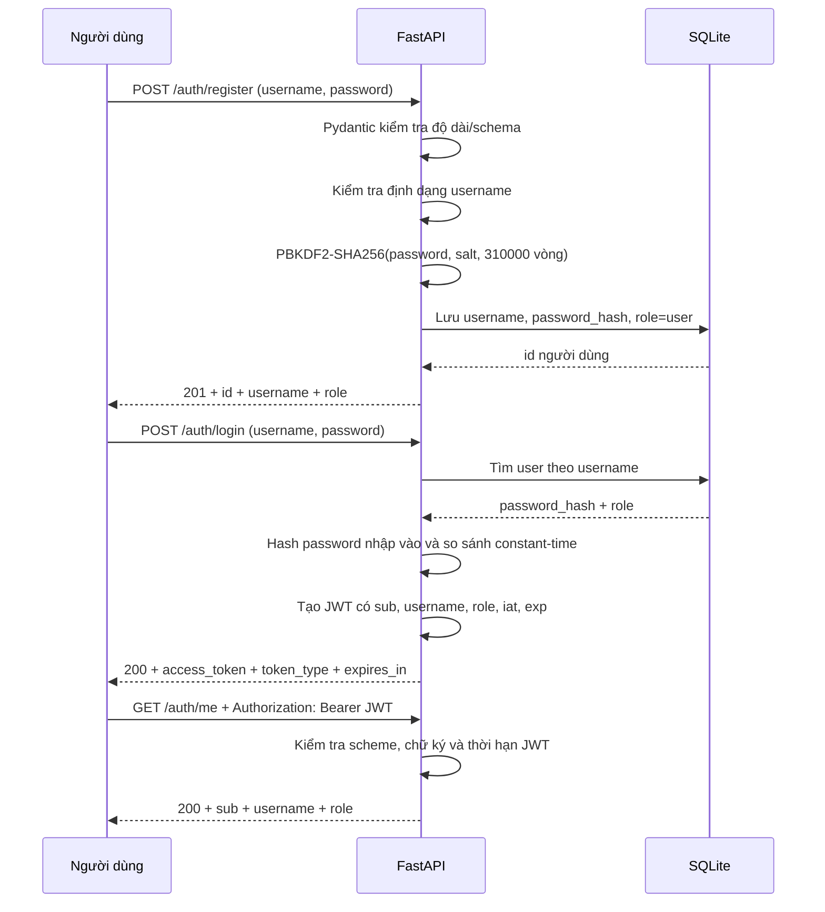

# BÁO CÁO KIỂM THỬ ĐĂNG KÝ VÀ ĐĂNG NHẬP

- Dự án: AI BI Dashboard Backend
- Ngày kiểm thử: 07/10/2026
- Múi giờ: Asia/Saigon
- Phạm vi: đăng ký, đăng nhập, JWT, đọc thông tin người dùng và lưu mật khẩu
- Server test: `http://127.0.0.1:8003`
- Database test: database SQLite tạm, tách biệt dữ liệu nghiệp vụ
- Kết quả tổng: **10/10 kiểm tra PASS** gồm 8 case HTTP, 1 kiểm tra database và 1 nhóm regression

## 1. Mục tiêu kiểm thử

Báo cáo trả lời các câu hỏi sau:

1. Người dùng mới có đăng ký được không?
2. Role mặc định sau đăng ký là gì?
3. Hệ thống xử lý username trùng như thế nào?
4. Schema có từ chối username/password không hợp lệ không?
5. Đăng nhập đúng có cấp JWT không?
6. Đăng nhập sai có bị từ chối không?
7. Endpoint private có yêu cầu Bearer token không?
8. Token bị sửa có bị từ chối không?
9. Mật khẩu có bị lưu dạng plaintext không?
10. Các test regression liên quan xác thực có tiếp tục PASS không?

## 2. Luồng hoạt động của hệ thống



## 3. Thành phần code tham gia

| File/hàm | Trách nhiệm |
|---|---|
| `backend/main.py::register` | Nhận request đăng ký và trả `201` |
| `backend/main.py::login` | Xác thực và cấp access token |
| `backend/main.py::current_user` | Đọc HTTP Bearer token và giải mã JWT |
| `backend/main.py::me` | Trả danh tính người dùng hiện tại |
| `backend/auth.py::create_user` | Chuẩn hóa username, hash password và ghi SQLite |
| `backend/auth.py::authenticate_user` | Tìm user và kiểm tra password |
| `backend/auth.py::hash_password` | PBKDF2-HMAC-SHA256 với salt ngẫu nhiên |
| `backend/auth.py::verify_password` | So sánh hash bằng `hmac.compare_digest` |
| `backend/auth.py::create_access_token` | Tạo JWT có thời gian hết hạn |
| `backend/auth.py::decode_access_token` | Kiểm tra cấu trúc, chữ ký và `exp` |

## 4. Điều kiện và dữ liệu kiểm thử

### 4.1. Tài khoản hợp lệ

```json
{
  "username": "authcheck_20261007",
  "password": "StrongPass_2026!"
}
```

### 4.2. Các quy tắc đầu vào

| Trường | Quy tắc ở API schema | Quy tắc nghiệp vụ |
|---|---|---|
| `username` | Chuỗi dài 3–64 ký tự | Chỉ nhận chữ cái, chữ số, dấu chấm, gạch ngang và gạch dưới |
| `password` | Chuỗi dài 8–256 ký tự | Được hash trước khi lưu |
| Field ngoài schema | Không chấp nhận | Request model dùng `extra = forbid` |

### 4.3. Cấu trúc bảng users

| Cột | Ý nghĩa |
|---|---|
| `id` | Primary key tự tăng |
| `username` | Unique, không null |
| `password_hash` | Hash mật khẩu, không lưu plaintext |
| `role` | Chỉ nhận `admin`, `manager`, `user` |
| `created_at` | Thời điểm tạo theo UTC |

## 5. Kết quả từng test case HTTP

### AUTH-01 — Đăng ký hợp lệ

- Endpoint: `POST /auth/register`
- Header: `Content-Type: application/json`
- Body: tài khoản hợp lệ ở mục 4.1.
- Thao tác: gửi request một lần vào database test chưa có username này.
- Kỳ vọng:
  - HTTP `201 Created`;
  - có `id`;
  - username giữ nguyên;
  - role mặc định là `user`;
  - response không trả password/password hash.
- Thực tế:

```json
{"id":2,"username":"authcheck_20261007","role":"user"}
```

- Kết quả: **PASS**.

### AUTH-02 — Đăng ký trùng username

- Endpoint: `POST /auth/register`
- Body: gửi lại chính xác body của AUTH-01.
- Kỳ vọng: HTTP `400`, không tạo user thứ hai.
- Thực tế:

```json
{
  "error": {
    "code": "INVALID_REQUEST",
    "message": "Username already exists",
    "details": {},
    "request_id": "<generated-request-id>"
  }
}
```

- Kết quả: **PASS**.
- Ý nghĩa: unique constraint và xử lý `sqlite3.IntegrityError` hoạt động.

### AUTH-03 — Username và password quá ngắn

- Endpoint: `POST /auth/register`
- Body:

```json
{"username":"ab","password":"123"}
```

- Kỳ vọng: HTTP `422`, request bị chặn ở schema trước khi ghi database.
- Thực tế: HTTP `422`; response chỉ rõ `username` và `password` không đạt `min_length`.
- Kết quả: **PASS**.

### AUTH-04 — Đăng nhập sai mật khẩu

- Endpoint: `POST /auth/login`
- Body:

```json
{
  "username": "authcheck_20261007",
  "password": "WrongPass_2026!"
}
```

- Kỳ vọng: HTTP `401`; không cấp token; không làm lộ hash hoặc cho biết chi tiết nội bộ.
- Thực tế:

```json
{"detail":"Invalid username or password"}
```

- Kết quả: **PASS**.

### AUTH-05 — Đăng nhập đúng

- Endpoint: `POST /auth/login`
- Body: tài khoản hợp lệ ở mục 4.1.
- Kỳ vọng:
  - HTTP `200`;
  - có `access_token`;
  - `token_type = bearer`;
  - `expires_in = 3600` giây.
- Thực tế: HTTP `200`, token tồn tại, đúng type và thời hạn.
- Response đã rút gọn để không ghi JWT thật vào báo cáo:

```json
{
  "access_token": "<redacted>",
  "token_type": "bearer",
  "expires_in": 3600
}
```

- Kết quả: **PASS**.

### AUTH-06 — Gọi API private không có token

- Endpoint: `GET /auth/me`
- Header Authorization: không gửi.
- Kỳ vọng: HTTP `401`.
- Thực tế:

```json
{"detail":"Missing bearer token"}
```

- Kết quả: **PASS**.

### AUTH-07 — Gọi API private với token hợp lệ

- Endpoint: `GET /auth/me`
- Header:

```text
Authorization: Bearer <access_token từ AUTH-05>
```

- Kỳ vọng: HTTP `200`, trả đúng user và role.
- Thực tế:

```json
{
  "sub": "2",
  "username": "authcheck_20261007",
  "role": "user"
}
```

- Kết quả: **PASS**.

### AUTH-08 — Token bị sửa chữ ký

- Endpoint: `GET /auth/me`
- Thao tác: thêm một ký tự vào cuối JWT hợp lệ rồi gửi lại.
- Kỳ vọng: HTTP `401`; không chấp nhận payload của token bị sửa.
- Thực tế:

```json
{"detail":"Invalid access token"}
```

- Kết quả: **PASS**.

## 6. Kiểm tra lưu mật khẩu

Sau AUTH-01, truy vấn cột `password_hash` của user test trong SQLite và chỉ kiểm tra metadata, không đưa hash/salt thật vào báo cáo.

| Kiểm tra | Kết quả |
|---|---|
| Giá trị lưu có bằng mật khẩu nhập vào không? | `False` |
| Thuật toán | `pbkdf2_sha256` |
| Số vòng lặp | `310000` |
| Có salt riêng | `True` |

Kết luận: mật khẩu **không lưu plaintext**. **PASS**.

## 7. Kiểm tra JWT chi tiết

Payload JWT hợp lệ chứa:

| Claim | Tác dụng |
|---|---|
| `sub` | ID người dùng |
| `username` | Username đã xác thực |
| `role` | Role dùng cho RBAC |
| `iat` | Thời điểm token được cấp |
| `exp` | Thời điểm token hết hạn |

Các nhánh đã kiểm tra:

- Token hợp lệ: giải mã thành công.
- Token bị sửa: bị từ chối.
- Token đã hết hạn: unit test tạo token với `expires_minutes = -1`, bị từ chối.
- Header không phải Bearer: `Authorization: Basic bad`, bị từ chối `401`.

## 8. Regression test liên quan

Lệnh chạy:

```powershell
D:\AI_BI\AI_BI_DASHBOARD_V1\.venv\Scripts\python.exe -m pytest `
  tests\test_api.py::ApiTests::test_public_auth_guards_cors_and_openapi `
  tests\test_backend.py::BackendTests::test_auth_hashes_password_and_signs_token `
  -vv -p no:cacheprovider
```

Kết quả:

```text
collected 2 items
test_public_auth_guards_cors_and_openapi PASSED
test_auth_hashes_password_and_signs_token PASSED
2 passed, 1 warning in 4.21s
```

Cảnh báo duy nhất là deprecation trong `starlette.testclient`; không ảnh hưởng đăng ký, đăng nhập hoặc server runtime.

## 9. Cách tự kiểm tra lại trên Swagger

### 9.1. Đăng ký

1. Chạy backend từ thư mục gốc:

```powershell
.\.venv\Scripts\python.exe backend\main.py
```

2. Mở `http://127.0.0.1:8000/docs`.
3. Mở `POST /auth/register`.
4. Bấm **Try it out**.
5. Nhập body:

```json
{
  "username": "manual_user_01",
  "password": "ManualPass_2026!"
}
```

6. Bấm **Execute**.
7. Kiểm tra response code `201`, role `user`, không có password trong response.

### 9.2. Đăng nhập

1. Mở `POST /auth/login`.
2. Bấm **Try it out**.
3. Nhập lại username/password vừa đăng ký.
4. Bấm **Execute**.
5. Kiểm tra `200`, `token_type = bearer`, `expires_in = 3600`.
6. Sao chép riêng giá trị `access_token`, không thêm chữ `Bearer` vào giá trị khi dùng hộp Authorize.

### 9.3. Xác minh token

1. Bấm **Authorize** ở đầu trang Swagger.
2. Dán access token vào trường `HTTPBearer`.
3. Bấm **Apply credentials**, sau đó **Close**.
4. Mở `GET /auth/me` → **Try it out** → **Execute**.
5. Kiểm tra curl có dòng `Authorization: Bearer ...`.
6. Kiểm tra response `200` trả đúng username và role.

## 10. Đánh giá bảo mật hiện tại

### Đã có

- Password hashing PBKDF2-SHA256 với salt ngẫu nhiên và 310.000 vòng.
- So sánh hash constant-time bằng `hmac.compare_digest`.
- Username unique trong database.
- JWT có chữ ký và thời gian hết hạn.
- HTTP Bearer được mô tả trong OpenAPI/Swagger.
- Role được đưa vào token và dùng cho RBAC.
- Request models cấm field thừa.
- Lỗi ngoài dự kiến được che, không trả traceback/đường dẫn/secrets.

### Chưa có hoặc chưa nằm trong phạm vi hiện tại

- Không có refresh token.
- Không có endpoint logout/revoke token; JWT hợp lệ đến khi hết hạn.
- Không có rate limiting cho login/register.
- Không có khóa tài khoản tạm thời sau nhiều lần đăng nhập sai.
- Chính sách password hiện kiểm tra độ dài, chưa bắt buộc chữ hoa/chữ thường/số/ký tự đặc biệt.
- Không có quy trình quên/đặt lại mật khẩu hoặc xác minh email.
- JWT chưa có cơ chế key rotation hoặc danh sách thu hồi.

Các mục này không làm thất bại yêu cầu đăng ký/đăng nhập hiện tại, nhưng cần xem xét trước khi triển khai production công khai.

## 11. Kết luận nghiệm thu

| Hạng mục | Trạng thái |
|---|---|
| Đăng ký user mới | PASS |
| Chặn username trùng | PASS |
| Kiểm tra schema đầu vào | PASS |
| Hash mật khẩu | PASS |
| Đăng nhập đúng | PASS |
| Từ chối sai mật khẩu | PASS |
| Cấp JWT có thời hạn | PASS |
| Bảo vệ API private | PASS |
| Từ chối token bị sửa/hết hạn | PASS |
| Trả đúng danh tính và role | PASS |

Kết luận: luồng đăng ký và đăng nhập **hoạt động đúng trong phạm vi thiết kế hiện tại**. Trước production nên ưu tiên rate limiting, refresh/revoke token và cơ chế khóa tạm thời.
