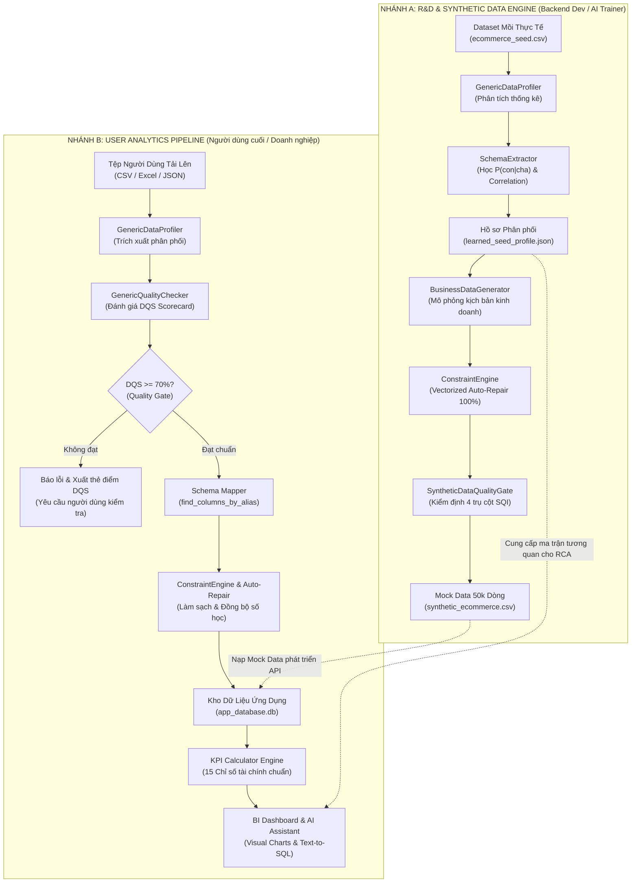

# KẾ HOẠCH BÀN GIAO KỸ THUẬT GIAI ĐOẠN 1 & 2
## DỰ ÁN AI BI DASHBOARD (CODE CANDY)
### TỔNG HỢP NỀN TẢNG SEMANTIC SCHEMA, SYNTHETIC ENGINE & CẨM NANG TRIỂN KHAI GIAI ĐOẠN TIẾP THEO

> **Dự án:** Code Candy – AI BI Dashboard  
> **Phạm vi tài liệu:** Kế hoạch bàn giao kỹ thuật Phase 1 & Phase 2, Cấu trúc hệ thống, Luồng dữ liệu, Kế hoạch thừa kế Phase 3 – 7, Runbook xử lý sự cố & Giới hạn kỹ thuật  
> **Phiên bản:** v2.0 (Phát hành chính thức)  
> **Ngày phát hành:** 08/10/2026  
> **Đơn vị bàn giao:** Nhóm Nghiên cứu & Phát triển AI Core / Backend Engine  
> **Đơn vị tiếp nhận:** Nhóm Backend Core, AI Agent & Frontend Application  

---

## MỤC LỤC

1. [I. THÔNG TIN CHUNG TIẾN ĐỘ 2 GIAI ĐOẠN](#i-thông-tin-chung-tiến-độ-2-giai-đoạn)
2. [II. TỔNG HỢP CÁC TASK ĐÃ HOÀN THIỆN (TASK 1 – TASK 7)](#ii-tổng-hợp-các-task-đã-hoàn-thiện-task-1--task-7)
3. [III. CẤU TRÚC THƯ MỤC VÀ CHỨC NĂNG CHI TIẾT TỪNG FILE](#iii-cấu-trúc-thư-mục-và-chức-năng-chi-tiết-từng-file)
4. [IV. CHI TIẾT CÁC TASK TƯƠNG LAI & MA TRẬN KẾ THỪA (GIAI ĐOẠN 3 – 7)](#iv-chi-tiết-các-task-tương-lai--ma-trận-kế-thừa-giai-đoạn-3--7)
5. [V. LUỒNG KIẾN TRÚC & DÒNG CHẢY DỮ LIỆU CỦA MODULE](#v-luồng-kiến-trúc--dòng-chảy-dữ-liệu-của-module)
6. [VI. QUY TRÌNH & CHECKLIST XỬ LÝ SỰ CỐ KHI DỮ LIỆU GẶP LỖI (DATA INCIDENT RUNBOOK)](#vi-quy-trình--checklist-xử-lý-sự-cố-khi-dữ-liệu-gặp-lỗi-data-incident-runbook)
7. [VII. CÁC GIỚI HẠN KỸ THUẬT ĐÃ GHI NHẬN & BIỆN PHÁP KHẮC PHỤC](#vii-các-giới-hạn-kỹ-thuật-đã-ghi-nhận--biện-pháp-khắc-phục)

---

## I. THÔNG TIN CHUNG TIẾN ĐỘ 2 GIAI ĐOẠN

### 1. Trạng thái tổng thể

Toàn bộ các mục tiêu nghiên cứu, trừu tượng hóa kiến trúc và đóng gói công cụ trong **Giai đoạn 1 (Phase 1)** và **Giai đoạn 2 (Phase 2)** đã hoàn thành **100% khối lượng công việc** theo đúng tiêu chuẩn kỹ thuật đề ra.

```
┌────────────────────────────────────────────────────────────────────────────────────────────────────────┐
│                              TỔNG KẾT TIẾN ĐỘ GIAI ĐOẠN 1 VÀ GIAI ĐOẠN 2                               │
├────────────────────────────────────────────────────┬───────────────────────────────────────────────────┤
│ GIAI ĐOẠN 1: Schema Abstraction & Benchmarking     │ GIAI ĐOẠN 2: Dynamic Engine & Quality Gate        │
│ • Trạng thái: Hoàn thành                      │ • Trạng thái: Hoàn thành                     │
│ • Phạm vi: Task 1, Task 2, Task 3                  │ • Phạm vi: Task 4, Task 5, Task 6, Task 7         │
│ • Kiểm định: 12/12 Unit Tests PASSED               │ • Kiểm định: 22/22 Unit Tests PASSED              │
│ • Bàn giao: 50k dòng Mock Data cho Backend         │ • Chỉ số SQI: 95.78 / 100 (Tier A - PASSED)       │
└────────────────────────────────────────────────────┴───────────────────────────────────────────────────┘
```

### 2. Các chỉ số định lượng trọng yếu đạt được

* **Tính toàn vẹn Logic & Số học (Hard Constraints Pass Rate):** Đạt **`100.0%`** (0 vi phạm trên $50,000$ dòng dữ liệu tổng hợp).
* **Điểm chất lượng dữ liệu mồi (Data Quality Scorecard - DQS):** Đạt **`98.31 / 100` điểm** (Tier A).
* **Chỉ số chất lượng dữ liệu tổng hợp (Synthetic Quality Index - SQI):** Đạt **`95.78 / 100` điểm** (Tier A - Vượt ngưỡng nghiệm thu $\ge 80$).
  * *Validity (Tính hợp lệ):* **`100.0%`** (Trọng số 30%).
  * *Fidelity (Tính trung thực thống kê):* **`91.34%`** (Trọng số 30%, KS-Test: 89.75%, TVD: 94.88%, Pearson Corr Sim: 92.15%).
  * *Privacy (Tính bảo mật & Chống rò rỉ):* **`91.88%`** (Trọng số 20%, 0 exact match, 0 ID leak, Mean DCR: 0.485).
  * *Utility (Tính hữu ích cho ML - TSTR):* **`100.0%`** (Trọng số 20%, $R^2 \approx 0.99$ trên Holdout Set).
* **Hiệu năng xử lý (Performance Benchmark):** Vectorized Auto-Repair kiểm tra và sửa lỗi **100,000 dòng trong $0.227$ giây** (vượt xa yêu cầu $< 2.0$ giây).
* **Độ bao phủ kiểm thử tự động (Automated Test Suite):** Toàn bộ **34/34 Unit Tests** vượt qua thành công trong **$8.23$ giây**.

---

## II. TỔNG HỢP CÁC TASK ĐÃ HOÀN THIỆN (TASK 1 – TASK 7)

```
┌────────────────────────────────────────────────────────────────────────────────────────────────────────┐
│                              DANH MỤC 7 TASK ĐÃ HOÀN THIỆN ĐẦY ĐỦ                                      │
├──────┬──────────────────────────────────────────┬─────────────────────────────┬────────────────────────┤
│ Task │ Tên hạng mục                             │ Module triển khai chính     │ Trạng thái nghiệm thu  │
├──────┼──────────────────────────────────────────┼─────────────────────────────┼────────────────────────┤
│ T1   │ Generic Schema Definition & Gold Model   │ semantic/schema_definition  │ 🟢 Hoàn thành (100%)   │
│ T2   │ Declarative Rules & Rule Engine          │ semantic/business_rules     │ 🟢 Hoàn thành (100%)   │
│ T3   │ Benchmark Datasets & Mock Handover       │ data/ & MANIFEST            │ 🟢 Hoàn thành (100%)   │
│ T4   │ Generic Profiler & Data Quality Audit    │ backend/eda/                │ 🟢 Hoàn thành (100%)   │
│ T5   │ Schema Extractor & Constraint Parser     │ backend/schema_learning/    │ 🟢 Hoàn thành (100%)   │
│ T6   │ Business Data Generator & Pipeline       │ backend/synthetic_generator/│ 🟢 Hoàn thành (100%)   │
│ T7   │ Automated Quality Gate & 4-Pillar Eval   │ eval/ & validator.py        │ 🟢 Hoàn thành (100%)   │
└──────┴──────────────────────────────────────────┴─────────────────────────────┴────────────────────────┘
```

### 1. Task 1: Chuẩn hóa Generic Schema Definition & E-Commerce Gold Template
* **Nội dung:** Xây dựng hệ thống Pydantic v2 Models trừu tượng hóa (`GenericSchema`, `TableDefinition`, `ColumnDefinition`, `MetricDefinition`, `RelationshipDefinition`). Thiết lập Gold Reference Schema cho E-commerce gồm 5 bảng (`customers`, `products`, `orders`, `sales`, `financials`), 15 chỉ số tài chính và 4 quan hệ khóa ngoại.
* **Tính năng nổi bật:** Hỗ trợ kiểm tra tính toàn vẹn cấu trúc khóa chính/khóa ngoại (`validate_schema()`) và tìm kiếm cột qua alias tự nhiên song ngữ Anh/Việt (`find_columns_by_alias()`).
* **Sản phẩm:** [`semantic/schema_definition.py`](file:///d:/PYTHON/Modal/Antigrafity/semantic/schema_definition.py), [`semantic/ecommerce_schema.json`](file:///d:/PYTHON/Modal/Antigrafity/semantic/ecommerce_schema.json).

### 2. Task 2: Trừu tượng hóa Ràng buộc Nghiệp vụ (Declarative Rules & Rule Engine)
* **Nội dung:** Tách toàn bộ logic nghiệp vụ khỏi mã nguồn cứng, tổ chức thành tệp JSON khai báo gồm 12 Hard Constraints (bắt buộc $100\%$) và 7 Soft Constraints (cảnh báo biên độ).
* **Tính năng nổi bật:** `BusinessRuleEngine` đánh giá vector hóa trên Pandas DataFrame và cơ chế **Vectorized Constraint Auto-Repair** tự động hiệu chỉnh các sai lệch số học ($Gross = Qty \times Price$, $Net = Gross - Discount$, $Net\_Profit = Gross\_Revenue - \sum Costs$).
* **Sản phẩm:** [`semantic/rules.json`](file:///d:/PYTHON/Modal/Antigrafity/semantic/rules.json), [`semantic/business_rules.py`](file:///d:/PYTHON/Modal/Antigrafity/semantic/business_rules.py).

### 3. Task 3: Chuẩn bị Benchmark Seed Data & Bàn giao Mock Data cho Backend
* **Nội dung:** Phân tách và đóng gói 3 tập dữ liệu chuẩn mực đồng bộ 38 thuộc tính, giải phóng phụ thuộc giữa nhóm AI và nhóm Backend.
* **Sản phẩm:**
  * [`data/generated/synthetic_ecommerce.csv`](file:///d:/PYTHON/Modal/Antigrafity/data/generated/synthetic_ecommerce.csv) (50,000 dòng, Mock Data chuẩn $100\%$ logic).
  * [`data/sample_dataset/ecommerce_seed.csv`](file:///d:/PYTHON/Modal/Antigrafity/data/sample_dataset/ecommerce_seed.csv) (35,000 dòng, Benchmark huấn luyện).
  * [`data/warehouse/real_holdout.csv`](file:///d:/PYTHON/Modal/Antigrafity/data/warehouse/real_holdout.csv) (15,000 dòng, Tập kiểm định cách ly $0\%$ rò rỉ).
  * [`data/DATA_HANDOVER_MANIFEST.md`](file:///d:/PYTHON/Modal/Antigrafity/data/DATA_HANDOVER_MANIFEST.md) (Tài liệu bàn giao).

### 4. Task 4: Generic Data Profiler & Quality Checker
* **Nội dung:** Xây dựng công cụ phân tích thống kê tự động cho bất kỳ DataFrame nào (nhận diện kiểu dữ liệu ngữ nghĩa, tính Mean, Std, Quantiles, Skewness, Kurtosis, phát hiện ngoại lệ $1.5 \times \text{IQR}$) và hệ thống chấm điểm chất lượng 4 khía cạnh: Completeness, Validity, Uniqueness, Consistency.
* **Sản phẩm:** [`backend/eda/profiling.py`](file:///d:/PYTHON/Modal/Antigrafity/backend/eda/profiling.py), [`backend/eda/quality_checker.py`](file:///d:/PYTHON/Modal/Antigrafity/backend/eda/quality_checker.py), [`docs/eda_seed_profiling.md`](file:///d:/PYTHON/Modal/Antigrafity/docs/eda_seed_profiling.md), [`docs/data_quality_audit.md`](file:///d:/PYTHON/Modal/Antigrafity/docs/data_quality_audit.md).

### 5. Task 5: Dynamic Schema Extractor & Constraint Parser
* **Nội dung:** Tự động học bảng xác suất có điều kiện $P(\text{con} \mid \text{cha})$ (danh mục sản phẩm, địa lý bang/thành phố, kênh thanh toán/phân khúc khách hàng) kèm cơ chế Fallback an toàn cho tập dữ liệu phẳng; trích xuất ma trận tương quan Pearson/Spearman sạch (loại bỏ $100\%$ `NaN`); xây dựng `ConstraintEngine` vector hóa kiểm tra và tự động sửa lỗi quy tắc nghiệp vụ trong $0.227$s/100k dòng.
* **Sản phẩm:** [`backend/schema_learning/schema_extractor.py`](file:///d:/PYTHON/Modal/Antigrafity/backend/schema_learning/schema_extractor.py), [`backend/schema_learning/rule_parser.py`](file:///d:/PYTHON/Modal/Antigrafity/backend/schema_learning/rule_parser.py), [`data/generated/learned_seed_profile.json`](file:///d:/PYTHON/Modal/Antigrafity/data/generated/learned_seed_profile.json).

### 6. Task 6: Business Data Generator Engine & Parameterized Pipeline
* **Nội dung:** Đóng gói cỗ máy sinh dữ liệu nghiệp vụ tổng hợp linh hoạt `BusinessDataGenerator` hỗ trợ giao diện chuẩn `fit()` và `generate()` với tham số hóa kịch bản kinh doanh (`growth_rate`, `holiday_season`, `margin_compression`). Thiết lập dịch vụ `SyntheticDataPipeline` điều phối sinh dữ liệu end-to-end.
* **Sản phẩm:** [`backend/synthetic_generator/generator_model.py`](file:///d:/PYTHON/Modal/Antigrafity/backend/synthetic_generator/generator_model.py), [`backend/synthetic_generator/pipeline.py`](file:///d:/PYTHON/Modal/Antigrafity/backend/synthetic_generator/pipeline.py).

### 7. Task 7: Automated Quality Gate & 4-Pillar Validation Engine
* **Nội dung:** Thiết lập cổng kiểm định chất lượng độc lập đánh giá 4 trụ cột khoa học (Validity $100\%$, Fidelity $91.34\%$, Privacy $91.88\%$, Utility $100\%$) tính toán chỉ số tổng hợp SQI và xuất báo cáo tự động.
* **Sản phẩm:** [`eval/fidelity_eval.py`](file:///d:/PYTHON/Modal/Antigrafity/eval/fidelity_eval.py), [`eval/privacy_eval.py`](file:///d:/PYTHON/Modal/Antigrafity/eval/privacy_eval.py), [`eval/utility_eval.py`](file:///d:/PYTHON/Modal/Antigrafity/eval/utility_eval.py), [`backend/synthetic_generator/validator.py`](file:///d:/PYTHON/Modal/Antigrafity/backend/synthetic_generator/validator.py), [`docs/synthetic_data_quality_report.md`](file:///d:/PYTHON/Modal/Antigrafity/docs/synthetic_data_quality_report.md).

---

## III. CẤU TRÚC THƯ MỤC VÀ CHỨC NĂNG CHI TIẾT TỪNG FILE

```text
d:\PYTHON\Modal\Antigrafity\
├── semantic/                                 # LỚP ĐỊNH NGHĨA NGỮ NGHĨA VÀ QUY TẮC KINH DOANH
│   ├── __init__.py                           # Export các hàm & lớp của package semantic
│   ├── schema_definition.py                  # Pydantic v2 Models, validation, alias matching & export schema
│   ├── ecommerce_schema.json                 # Gold Template E-Commerce (5 bảng, 15 KPIs, 38 cột chuẩn)
│   ├── rules.json                            # File khai báo 12 Hard Constraints & 7 Soft Constraints
│   └── business_rules.py                     # BusinessRuleEngine: Vectorized evaluation & Auto-Repair toán học
│
├── backend/                                  # LÕI XỬ LÝ BACKEND ENGINE
│   ├── eda/                                  # Module phân tích thống kê & kiểm định chất lượng dữ liệu
│   │   ├── __init__.py                       # Export GenericDataProfiler & GenericQualityChecker
│   │   ├── profiling.py                      # Trích xuất phân phối Mean, Std, Quantiles, Outliers IQR cho DataFrame
│   │   └── quality_checker.py                # Đánh giá 4 khía cạnh DQS: Completeness, Validity, Uniqueness, Consistency
│   │
│   ├── schema_learning/                      # Module học phân phối có điều kiện & phân giải quy tắc
│   │   ├── __init__.py                       # Export SchemaExtractor & ConstraintEngine
│   │   ├── schema_extractor.py               # Học P(con|cha), ma trận tương quan Pearson/Spearman, xuất LearnedProfile
│   │   └── rule_parser.py                    # Biên dịch rules.json thành ConstraintEngine vector hóa cực nhanh
│   │
│   └── synthetic_generator/                  # Module sinh dữ liệu tổng hợp & điều phối đường ống
│       ├── __init__.py                       # Export BusinessDataGenerator, Pipeline & QualityGate
│       ├── generator_model.py                # Class sinh dữ liệu fit() & generate() theo kịch bản kinh doanh
│       ├── pipeline.py                       # Dịch vụ điều phối nạp profile, sinh mẫu, ép ràng buộc & lưu file
│       └── validator.py                      # SyntheticDataQualityGate: Cổng kiểm định 4 trụ cột (Validity, Fidelity, Privacy, Utility)
│
├── eval/                                     # BỘ CÔNG CỤ ĐÁNH GIÁ CHẤT LƯỢNG ĐỘC LẬP
│   ├── __init__.py                           # Export FidelityEvaluator, PrivacyEvaluator, UtilityEvaluator
│   ├── fidelity_eval.py                      # Đánh giá Kolmogorov-Smirnov (KS-Test), TVD & Pearson Similarity
│   ├── privacy_eval.py                       # Đánh giá Exact-Match, Real ID Leakage & Khoảng cách DCR
│   └── utility_eval.py                       # Đánh giá Machine Learning Utility (TSTR vs TRTR) trên Holdout Set
│
├── data/                                     # PHÂN KHU LƯU TRỮ DỮ LIỆU
│   ├── sample_dataset/                       # Dữ liệu mẫu benchmark
│   │   └── ecommerce_seed.csv                # Tập dữ liệu mồi huấn luyện chuẩn hóa (35,000 dòng, 38 cột)
│   ├── generated/                            # Dữ liệu sinh tự động & Artifacts
│   │   ├── learned_seed_profile.json         # Hồ sơ phân phối thống kê chuẩn hóa không chứa NaN (743 KB)
│   │   └── synthetic_ecommerce.csv           # Bộ Mock Data tài chính chuẩn hóa (50,000 dòng, 100% Valid)
│   ├── warehouse/                            # Kho dữ liệu ứng dụng & Kiểm định độc lập
│   │   └── real_holdout.csv                  # Tập kiểm định cách ly phục vụ đánh giá TSTR (15,000 dòng)
│   └── DATA_HANDOVER_MANIFEST.md             # Tệp kê khai kỹ thuật bàn giao dữ liệu chính thức
│
├── tests/                                    # BỘ KIỂM THỬ TỰ ĐỘNG (34 UNIT TESTS)
│   ├── test_schema_definition.py             # 4 tests: Kiểm tra Pydantic schema, foreign keys, alias search
│   ├── test_business_rules.py                # 4 tests: Kiểm tra BusinessRuleEngine, vector hóa, auto-repair
│   ├── test_benchmark_data.py                # 4 tests: Kiểm tra 3 tập dataset, cấu trúc 38 cột, 0% data leakage
│   ├── test_profiling_and_quality.py         # 4 tests: Kiểm tra GenericDataProfiler, DQS score calculation
│   ├── test_schema_learning.py               # 6 tests: Kiểm tra SchemaExtractor, tương quan sạch, ConstraintEngine
│   ├── test_synthetic_generator.py           # 7 tests: Kiểm tra fit/generate, mô phỏng kịch bản, pipeline service
│   └── test_quality_gate.py                  # 5 tests: Kiểm tra 4 trụ cột và SyntheticDataQualityGate
│
└── docs/                                     # TÀI LIỆU BÁO CÁO KỸ THUẬT DỰ ÁN
    ├── bao_cao_hoan_thien_giai_doan_1_v2.md  # Báo cáo tổng kết hoàn thiện Giai đoạn 1 (v2)
    ├── bao_cao_hoan_thien_giai_doan_2_v2.md  # Báo cáo tổng kết hoàn thiện Giai đoạn 2 (v2)
    ├── eda_seed_profiling.md                 # Báo cáo phân tích thống kê tập Seed Data
    ├── data_quality_audit.md                 # Báo cáo kiểm định chất lượng tập Seed Data
    ├── synthetic_data_quality_report.md      # Báo cáo kiểm định chất lượng dữ liệu tổng hợp (SQI Audit)
    └── ke_hoach_ban_giao_giai_doan_1_2.md    # Tài liệu Kế hoạch bàn giao kỹ thuật hiện tại
```

---

## IV. CHI TIẾT CÁC TASK TƯƠNG LAI & MA TRẬN KẾ THỪA (GIAI ĐOẠN 3 – 7)

```
┌────────────────────────────────────────────────────────────────────────────────────────────────────────┐
│                          LỘ TRÌNH TRIỂN KHAI CÁC GIAI ĐOẠN TƯƠNG LAI (PHASE 3 – 7)                     │
├──────────┬──────────────┬──────────────────────────────────────────────────────────────────────────────┤
│ Giai đoạn│ Các Task     │ Trọng tâm phát triển                                                         │
├──────────┼──────────────┼──────────────────────────────────────────────────────────────────────────────┤
│ Phase 3  │ Task 8 – 12  │ Backend Core: Dashboard Engine, Ingestion Pipeline & Report Exporter         │
│ Phase 4  │ Task 13 – 16 │ AI Engine: Local LLM, Text-to-SQL Guardrails, Root Cause & Voice Assistant    │
│ Phase 5  │ Task 17 – 20 │ Frontend Web: Next.js/React Dashboard, Charts, Chat UI & Quality Auditor UI   │
│ Phase 6  │ Task 21 – 22 │ Integration: WebSocket Streaming, Security Hardening & Rate Limiting         │
│ Phase 7  │ Task 23 – 24 │ Validation & Delivery: Holdout Acceptance Test, Docker Packaging & Handover  │
└──────────┴──────────────┴──────────────────────────────────────────────────────────────────────────────┘
```

### 1. Chi tiết từng Task và Tài nguyên Kế thừa

#### 🚀 GIAI ĐOẠN 3: BACKEND CORE – DASHBOARD ENGINE & INGESTION (Task 8 – 12)

* **Task 8: FastAPI Server Core & Database Configuration**
  * *Mục tiêu:* Khởi tạo server FastAPI (`backend/main.py`), CORS middleware, Router modular, tệp cấu hình trung tâm (`backend/config.py`) và thiết lập cơ sở dữ liệu SQLite/PostgreSQL (`data/warehouse/app_database.db`).
  * *Kế thừa từ Phase 1 & 2:*
    * Cấu trúc bảng và kiểu dữ liệu từ [`semantic/schema_definition.py`](file:///d:/PYTHON/Modal/Antigrafity/semantic/schema_definition.py) và [`semantic/ecommerce_schema.json`](file:///d:/PYTHON/Modal/Antigrafity/semantic/ecommerce_schema.json) để khởi tạo DDL database tự động.
    * Nạp dữ liệu khởi tạo (Initial Seeding) từ [`data/generated/synthetic_ecommerce.csv`](file:///d:/PYTHON/Modal/Antigrafity/data/generated/synthetic_ecommerce.csv).
  * *Lợi ích kế thừa:* Không cần định nghĩa lại cấu trúc bảng bằng tay, bảo đảm 100% khớp nối giữa DB schema và mô hình Pydantic.

* **Task 9: Authentication & Role-Based Access Control (RBAC)**
  * *Mục tiêu:* Xây dựng `backend/auth.py` quản lý tài khoản người dùng, băm mật khẩu bcrypt, phát hành JWT Access/Refresh Token và phân quyền vai trò (Admin, Financial Manager, Analyst, Viewer).
  * *Kế thừa từ Phase 1 & 2:* Cấu trúc phân quyền dữ liệu và bảo mật đã thiết kế trong kiến trúc Semantic Schema.

* **Task 10: User Data Ingestion & Cleansing Pipeline**
  * *Mục tiêu:* Xây dựng `backend/dashboard_engine/data_pipeline.py` tiếp nhận tệp tải lên từ người dùng (CSV, Excel, JSON), tự động phân tích chất lượng, đối soát cấu trúc và làm sạch dữ liệu trước khi lưu vào kho dữ liệu.
  * *Kế thừa từ Phase 1 & 2:*
    * Sử dụng trực tiếp [`GenericDataProfiler`](file:///d:/PYTHON/Modal/Antigrafity/backend/eda/profiling.py) để tự động nhận diện kiểu dữ liệu và trích xuất thống kê mô tả.
    * Sử dụng trực tiếp [`GenericQualityChecker`](file:///d:/PYTHON/Modal/Antigrafity/backend/eda/quality_checker.py) để tính toán điểm DQS (Completeness, Validity, Uniqueness, Consistency) và chặn các tệp dữ liệu rác trước khi nạp vào DB.
    * Tái sử dụng `find_columns_by_alias()` từ [`semantic/schema_definition.py`](file:///d:/PYTHON/Modal/Antigrafity/semantic/schema_definition.py) để tự động ánh xạ cột của người dùng sang cột chuẩn.
    * Tái sử dụng `ConstraintEngine.enforce_constraints()` từ [`backend/schema_learning/rule_parser.py`](file:///d:/PYTHON/Modal/Antigrafity/backend/schema_learning/rule_parser.py) để tự động sửa các lỗi số học ($Gross, Net, Profit$).
  * *Lợi ích kế thừa:* Rút ngắn đáng kể thời gian xây dựng logic tiền xử lý và kiểm định chất lượng cho module Ingestion nhờ tái sử dụng các engine cốt lõi đã được kiểm thử độc lập, bảo đảm dữ liệu đầu vào luôn đồng bộ với chuẩn schema hệ thống.

* **Task 11: Analytics & Financial KPI Calculation Engine**
  * *Mục tiêu:* Xây dựng `backend/dashboard_engine/kpi_calculator.py` và `chart_generator.py` tính toán các chỉ số kinh doanh tổng hợp, phân tích xu hướng thời gian, phân khúc khách hàng, hiệu quả marketing và cấu hình dữ liệu biểu đồ.
  * *Kế thừa từ Phase 1 & 2:*
    * Sử dụng trực tiếp 15 công thức tài chính chuẩn trong [`semantic/business_rules.py`](file:///d:/PYTHON/Modal/Antigrafity/semantic/business_rules.py) (`calc_gross_sales`, `calc_net_sales`, `calc_gross_profit`, `calc_gross_margin_pct`, `calc_net_profit`, `calc_net_margin_pct`, `calc_roas`, `calc_cac`, `calc_aov`, `calc_clv`, `calc_burn_rate`).
    * Sử dụng định nghĩa `semantic_metrics` và các câu truy vấn mẫu `sql_expression` trong [`semantic/ecommerce_schema.json`](file:///d:/PYTHON/Modal/Antigrafity/semantic/ecommerce_schema.json).
  * *Lợi ích kế thừa:* Đảm bảo 100% các công thức tính toán tuân thủ đúng định nghĩa kế toán và thống nhất giữa Backend API, Dashboard biểu đồ và AI Agent.

* **Task 12: Automated Report Exporter Engine**
  * *Mục tiêu:* Xây dựng `backend/dashboard_engine/report_exporter.py` hỗ trợ xuất báo cáo phân tích kinh doanh ra các định dạng chuẩn nghiệp vụ: PDF (kèm biểu đồ trực quan), Excel (nhiều sheet phân tích) và PowerPoint (bộ slide thuyết trình tóm tắt cho ban giám đốc).
  * *Kế thừa từ Phase 1 & 2:* Sử dụng cấu trúc định dạng báo cáo, bảng chỉ số chuẩn và các tiêu đề đa ngôn ngữ từ `semantic/schema_definition.py`.

---

#### 🧠 GIAI ĐOẠN 4: AI ENGINE – CHATBOT, AGENT & TEXT-TO-SQL (Task 13 – 16)

* **Task 13: Local LLM & Ollama / Gemini Client Integration**
  * *Mục tiêu:* Xây dựng `backend/ai_agent/llm_client.py` hỗ trợ kết nối linh hoạt mô hình ngôn ngữ lớn cục bộ (Ollama / Qwen / Llama) và API đám mây (Google Gemini 1.5/2.0 Pro/Flash), tích hợp cơ chế Retry, Timeout và Caching kết quả.

* **Task 14: Text-to-SQL Generator with Semantic Guardrails**
  * *Mục tiêu:* Xây dựng `backend/ai_agent/text_to_sql.py` chuyển đổi câu hỏi bằng ngôn ngữ tự nhiên của người dùng thành truy vấn SQL an toàn (chỉ cho phép `SELECT`, chặn `DROP`, `DELETE`, `UPDATE`), bảo đảm truy vấn đúng tên cột và cú pháp cơ sở dữ liệu.
  * *Kế thừa từ Phase 1 & 2:*
    * Nạp trực tiếp ngữ cảnh Schema từ [`semantic/ecommerce_schema.json`](file:///d:/PYTHON/Modal/Antigrafity/semantic/ecommerce_schema.json) và các hàm tìm kiếm bí danh `find_columns_by_alias()` vào System Prompt để LLM không bị ảo giác tên cột.
    * Nạp `sql_expression` của 15 KPIs chuẩn từ `semantic/schema_definition.py` làm Few-shot Examples cho Text-to-SQL Engine.
  * *Lợi ích kế thừa:* Cung cấp ngữ cảnh ràng buộc schema chặt chẽ và các mẫu truy vấn vàng (Gold Few-shot SQL) giúp hạn chế tối đa hiện tượng ảo giác (hallucination) và nâng cao tỷ lệ sinh cú pháp SQL chính xác.

* **Task 15: Agentic Business Insight & Root Cause Analysis Engine**
  * *Mục tiêu:* Xây dựng `backend/ai_agent/insight_engine.py` tự động phát hiện dị thường kinh doanh (sụt giảm doanh thu, tăng đột biến chi phí marketing, biên lợi nhuận thu hẹp) và phân tích nguyên nhân gốc rễ (Root Cause Analysis).
  * *Kế thừa từ Phase 1 & 2:*
    * Sử dụng ma trận tương quan sạch `learned_correlation_matrix` từ [`data/generated/learned_seed_profile.json`](file:///d:/PYTHON/Modal/Antigrafity/data/generated/learned_seed_profile.json) để xác định các cặp chỉ số có tương quan mạnh (ví dụ: `marketing_spend` ảnh hưởng đến `gross_sales`).
    * Sử dụng các ngưỡng bất thường từ danh sách **Soft Constraints** trong [`semantic/rules.json`](file:///d:/PYTHON/Modal/Antigrafity/semantic/rules.json) (ví dụ: `platform_fee > 35%`, `discount_rate > 60%`) làm tín hiệu cảnh báo.

* **Task 16: Voice Assistant & Speech-to-Text / Text-to-Speech**
  * *Mục tiêu:* Xây dựng `backend/ai_agent/voice_service.py` hỗ trợ tương tác bằng giọng nói: nhận diện giọng nói (STT qua Whisper/Web Speech API) và đọc tóm tắt báo cáo kinh doanh bằng giọng đọc tự nhiên (TTS).

---

#### 💻 GIAI ĐOẠN 5: FRONTEND WEB APPLICATION (Task 17 – 20)

* **Task 17: Modern Dashboard Shell & Component Layout**
  * *Mục tiêu:* Xây dựng khung giao diện người dùng bằng Next.js 14 / React với TailwindCSS, Dark/Light theme, Sidebar điều hướng, Header chứa thông tin người dùng và phân quyền RBAC.

* **Task 18: Dynamic Financial Charts & Visualizations**
  * *Mục tiêu:* Xây dựng các widget biểu đồ tài chính tương tác cao (Recharts / ECharts): Biểu đồ dòng tiền, Xu hướng doanh thu & lợi nhuận, Bản đồ nhiệt phân bố địa lý theo bang/thành phố, Phễu chuyển đổi marketing.
  * *Kế thừa từ Phase 1 & 2:* Sử dụng đúng tên 38 trường và 15 KPIs chuẩn để ánh xạ dữ liệu lên biểu đồ.

* **Task 19: AI Assistant Chat Interface & Natural Language Query UI**
  * *Mục tiêu:* Giao diện hội thoại AI dạng Streaming, hiển thị câu trả lời thông minh kèm bảng dữ liệu kết quả, biểu đồ minh họa sinh động và nút xuất báo cáo tức thì.

* **Task 20: Data Ingestion & Quality Audit Preview UI**
  * *Mục tiêu:* Xây dựng giao diện kéo-thả tệp dữ liệu, hiển thị bảng xem trước (Preview), màn hình đối chiếu Schema (Schema Mapping UI) và **Thẻ điểm chất lượng dữ liệu (Data Quality Scorecard UI)** hiển thị trực quan 4 chỉ số Completeness, Validity, Uniqueness, Consistency trước khi người dùng xác nhận lưu vào hệ thống.
  * *Kế thừa từ Phase 1 & 2:* Hiển thị trực tiếp kết quả trả về từ API Task 10 (vốn dựa trên `GenericDataProfiler` và `GenericQualityChecker` của Task 4).

---

#### 🔒 GIAI ĐOẠN 6 & 7: TÍCH HỢP, BẢO MẬT & NGHIỆM THU HỆ THỐNG (Task 21 – 24)

* **Task 21: End-to-End API Integration & WebSocket Streaming**
  * *Mục tiêu:* Kết nối đồng bộ giữa Frontend và Backend qua RESTful API và WebSocket cho luồng hội thoại AI thời gian thực.
* **Task 22: Security Hardening, Rate Limiting & Performance Benchmarking**
  * *Mục tiêu:* Bảo mật API (SQL Injection guard, Rate Limiting slowapi, CORS strict), đo lường tải và tối ưu độ trễ phản hồi $< 500\text{ms}$.
* **Task 23: Holdout Acceptance Evaluation on Real Data**
  * *Mục tiêu:* Chạy bộ đánh giá nghiệm thu toàn diện hệ thống phân tích, mô hình dự báo và trợ lý AI trên tập dữ liệu cách ly độc lập [`data/warehouse/real_holdout.csv`](file:///d:/PYTHON/Modal/Antigrafity/data/warehouse/real_holdout.csv) ($15,000$ dòng) để kiểm chứng độ chính xác thực tế.
  * *Kế thừa từ Phase 1 & 2:* Sử dụng bộ công cụ [`eval/fidelity_eval.py`](file:///d:/PYTHON/Modal/Antigrafity/eval/fidelity_eval.py), [`eval/privacy_eval.py`](file:///d:/PYTHON/Modal/Antigrafity/eval/privacy_eval.py), [`eval/utility_eval.py`](file:///d:/PYTHON/Modal/Antigrafity/eval/utility_eval.py).
* **Task 24: Final Packaging, Docker Deployment & Handover**
  * *Mục tiêu:* Đóng gói Docker Compose toàn bộ hệ thống (FastAPI Backend, Next.js Frontend, Database, Local LLM service) và hoàn thiện tài liệu hướng dẫn vận hành.

---

### 2. Bảng Ma trận Kế thừa Tài nguyên (Resource Inheritance Matrix)

| Module / Tệp nguồn (Phase 1 & 2) | Thành phần xuất bản chính | Các Task tương lai kế thừa trực tiếp | Vai trò và Mục đích sử dụng |
|---|---|:---:|---|
| [`semantic/schema_definition.py`](file:///d:/PYTHON/Modal/Antigrafity/semantic/schema_definition.py) | `GenericSchema`, `find_columns_by_alias()` | **Task 8, 10, 14, 18** | Khởi tạo DDL Database, Tự động map cột người dùng, Semantic prompt cho Text-to-SQL |
| [`semantic/ecommerce_schema.json`](file:///d:/PYTHON/Modal/Antigrafity/semantic/ecommerce_schema.json) | Gold Standard Metadata & 15 KPIs | **Task 8, 11, 14, 18** | Cấu trúc bảng chuẩn, Định nghĩa công thức SQL KPI cho Analytics Engine & Chatbot |
| [`semantic/rules.json`](file:///d:/PYTHON/Modal/Antigrafity/semantic/rules.json) | 12 Hard Rules + 7 Soft Rules | **Task 10, 15** | Quy tắc lọc làm sạch dữ liệu người dùng, Ngưỡng cảnh báo bất thường kinh doanh (RCA) |
| [`semantic/business_rules.py`](file:///d:/PYTHON/Modal/Antigrafity/semantic/business_rules.py) | 15 Financial Metric Functions | **Task 11, 12** | Động cơ tính toán tài chính chuẩn xác cho Dashboard và xuất file báo cáo PDF/Excel |
| [`backend/eda/profiling.py`](file:///d:/PYTHON/Modal/Antigrafity/backend/eda/profiling.py) | `GenericDataProfiler` | **Task 10, 20** | Phân tích thống kê tự động cho tệp dữ liệu người dùng tải lên |
| [`backend/eda/quality_checker.py`](file:///d:/PYTHON/Modal/Antigrafity/backend/eda/quality_checker.py) | `GenericQualityChecker` | **Task 10, 20** | Tính điểm chất lượng DQS và hiển thị thẻ điểm kiểm định trước khi nạp dữ liệu |
| [`backend/schema_learning/rule_parser.py`](file:///d:/PYTHON/Modal/Antigrafity/backend/schema_learning/rule_parser.py)| `ConstraintEngine.enforce_constraints()`| **Task 10** | Tự động sửa lỗi số học trong dữ liệu người dùng tải lên với tốc độ $< 0.3$s |
| [`data/generated/learned_seed_profile.json`](file:///d:/PYTHON/Modal/Antigrafity/data/generated/learned_seed_profile.json)| Clean Correlation Matrix & Profile | **Task 15** | Cung cấp ma trận tương quan làm tri thức nền tảng cho phân tích nguyên nhân gốc rễ (AI) |
| [`data/generated/synthetic_ecommerce.csv`](file:///d:/PYTHON/Modal/Antigrafity/data/generated/synthetic_ecommerce.csv)| 50,000 dòng Mock Data chuẩn | **Task 8, 11, 18, 21**| Cung cấp dữ liệu mẫu chuẩn để phát triển API Backend, Vẽ biểu đồ Frontend & Test tải |
| [`data/warehouse/real_holdout.csv`](file:///d:/PYTHON/Modal/Antigrafity/data/warehouse/real_holdout.csv) | 15,000 dòng Holdout Set cách ly | **Task 23** | Tập dữ liệu thực nghiệm độc lập dùng để nghiệm thu toàn bộ hệ thống ở Task 23 |
| [`eval/` & `validator.py`](file:///d:/PYTHON/Modal/Antigrafity/backend/synthetic_generator/validator.py) | 4-Pillar Quality Gate Suite | **Task 23** | Bộ công cụ tự động đánh giá tính hợp lệ, bảo mật và hữu ích khi nghiệm thu hệ thống |

---

## V. LUỒNG KIẾN TRÚC & DÒNG CHẢY DỮ LIỆU CỦA MODULE

Hệ thống được thiết kế với sự phân tách tuyệt đối giữa **Luồng A (Nghiên cứu & Sinh dữ liệu tổng hợp)** và **Luồng B (Xử lý & Phân tích dữ liệu người dùng)**:

### 1. Sơ đồ Kiến trúc Tổng thể Hai Luồng (Mermaid Flowchart)



### 2. Phân tích chi tiết hai dòng chảy dữ liệu

#### A. Luồng A: R&D & Synthetic Data Engine (Dành cho Kỹ sư / Huấn luyện mô hình)
1. **Đầu vào:** Tập dữ liệu mồi (`ecommerce_seed.csv`, 35k dòng).
2. **Học cấu trúc:** `GenericDataProfiler` đo lường phân phối $\rightarrow$ `SchemaExtractor` tính toán bảng xác suất có điều kiện $P(\text{con} \mid \text{cha})$, phân phối phụ thuộc danh mục và ma trận tương quan.
3. **Lưu trữ hồ sơ:** Xuất ra [`learned_seed_profile.json`](file:///d:/PYTHON/Modal/Antigrafity/data/generated/learned_seed_profile.json) (không chứa dữ liệu thô nhạy cảm).
4. **Sinh mẫu tham số hóa:** `BusinessDataGenerator` nhận các kịch bản (`growth_rate`, `holiday_season`, v.v.) và sinh ngẫu nhiên số lượng bản ghi tùy ý ($N$ dòng).
5. **Cưỡng chế ràng buộc:** `ConstraintEngine` vector hóa ép toàn bộ $12$ Hard Constraints, đảm bảo $100\%$ tính nhất quán số học.
6. **Kiểm định chất lượng:** `SyntheticDataQualityGate` so sánh với tập Holdout Set theo 4 trụ cột (Validity, Fidelity, Privacy, Utility). Chỉ cho phép xuất bản khi đạt SQI $\ge 80$.

#### B. Luồng B: User Analytics Pipeline (Dành cho Người dùng cuối tải file lên)
1. **Tải lên & Khám phá:** Người dùng tải file kinh doanh lên hệ thống qua API Task 10.
2. **Kiểm định chất lượng tức thì (Instant Quality Audit):** `GenericDataProfiler` và `GenericQualityChecker` tự động quét toàn bộ file, tạo thẻ điểm chất lượng (DQS). Nếu điểm quá thấp ($< 70$), hệ thống thông báo lỗi kèm danh sách vi phạm.
3. **Ánh xạ cột ngữ nghĩa (Semantic Mapping):** Sử dụng `find_columns_by_alias()` để tự động nhận diện cột (ví dụ: *"Tổng tiền"* $\rightarrow$ `gross_sales`, *"Tiền giảm"* $\rightarrow$ `discount_amount`). Nếu chưa có danh mục phân tầng, hệ thống tự động gán phân loại độc lập.
4. **Làm sạch & Tự động sửa lỗi (Auto-Repair):** `ConstraintEngine` tự động cân bằng các trường số học ($Gross - Discount = Net$), điền giá trị thiếu an toàn, kiểm tra tính đơn điệu thời gian.
5. **Lưu kho & Phân tích:** Nạp dữ liệu sạch vào Database $\rightarrow$ `kpi_calculator.py` tính 15 chỉ số tài chính $\rightarrow$ Render lên Dashboard và cung cấp ngữ cảnh cho AI Text-to-SQL.

---

## VI. QUY TRÌNH & CHECKLIST XỬ LÝ SỰ CỐ KHI DỮ LIỆU GẶP LỖI (DATA INCIDENT RUNBOOK)

Cẩm nang này hướng dẫn kỹ sư Backend và đội ngũ vận hành xử lý nhanh các tình huống lỗi dữ liệu trong quá trình Ingestion hoặc Generation.

```
┌────────────────────────────────────────────────────────────────────────────────────────────────────────┐
│                              QUY TRÌNH 4 BƯỚC XỬ LÝ SỰ CỐ DỮ LIỆU (RUNBOOK)                            │
├────────────────────────────────────────────────────────────────────────────────────────────────────────┤
│ BƯỚC 1: CÔ LẬP VÀ PHÂN LOẠI SỰ CỐ (Triage & Isolation)                                                 │
│ • Xác định nguồn gốc lỗi (Do tệp người dùng tải lên hay do tham số Generator).                         │
│ • Kiểm tra mức độ nghiêm trọng: Blocking Error (Hard Constraint) hay Warning (Soft Constraint).        │
├────────────────────────────────────────────────────────────────────────────────────────────────────────┤
│ BƯỚC 2: CHẨN ĐOÁN CHI TIẾT (Diagnosis via Profiler & Rule Engine)                                      │
│ • Chạy GenericDataProfiler.profile() để xác định tỷ lệ Null, kiểu dữ liệu sai, ngoại lệ cực đoan.      │
│ • Chạy BusinessRuleEngine.evaluate_dataframe() để trích xuất danh sách row_index vi phạm.              │
├────────────────────────────────────────────────────────────────────────────────────────────────────────┤
│ BƯỚC 3: ÁP DỤNG BIỆN PHÁP HIỆU CHỈNH (Mitigation & Auto-Repair)                                        │
│ • Dùng ConstraintEngine.enforce_constraints() để tự động sửa chữa các lỗi số học.                     │
│ • Áp dụng chiến lược Imputation phù hợp (Median cho biến số lệch, Mode cho biến phân loại).            │
├────────────────────────────────────────────────────────────────────────────────────────────────────────┤
│ BƯỚC 4: TÁI KIỂM ĐỊNH VÀ XÁC NHẬN (Re-validation & Audit Logging)                                      │
│ • Chạy lại GenericQualityChecker để xác nhận DQS >= 85%.                                               │
│ • Ghi nhận log chi tiết vào hệ thống audit trail.                                                      │
└────────────────────────────────────────────────────────────────────────────────────────────────────────┘
```

### 1. Bảng hướng dẫn xử lý các sự cố dữ liệu phổ biến

| Mã sự cố | Hiện tượng / Thông báo lỗi | Nguyên nhân gốc rễ | Quy trình & Lệnh khắc phục |
|:---:|---|---|---|
| **INC-01** | `HardConstraintViolation: HR_SALES_001` ($Gross \ne Qty \times Price$) | Dữ liệu gốc nhập sai giá gộp hoặc có sai số làm tròn số học | Chạy `ConstraintEngine.enforce_constraints(df)` hoặc `engine.repair_dataframe(df, 'sales')` để tự động gán lại $gross\_sales = quantity \times unit\_price$. |
| **INC-02** | `HardConstraintViolation: HR_SALES_003` ($Net \ne Gross - Discount$) | Cột `net_sales` không trừ chiết khấu hoặc tính sai thuế | Chạy tự động sửa lỗi: $net\_sales = gross\_sales - discount\_amount$. Nếu $discount > gross$, gán $discount = gross$. |
| **INC-03** | `TemporalMonotonicityError: HR_ORD_002` ($Delivered < Purchase$) | Ngày giao hàng ghi nhận trước ngày đặt hàng do lỗi múi giờ hoặc nhập sai | Áp dụng logic hiệu chỉnh thời gian: Nếu $delivery < purchase$, đặt $delivery = purchase + \Delta t_{\text{median}}$ (với $\Delta t_{\text{median}} = 3$ ngày). |
| **INC-04** | `CorrelationMatrixNaN: Zero Variance` (Ma trận tương quan có `NaN`) | Tồn tại cột hằng số (ví dụ: `quantity = 1` cho tất cả các dòng, $\sigma = 0$) | Gọi `SchemaExtractor._compute_correlations(df)` đã được tích hợp sẵn bộ lọc `std > 0` và `.fillna(0.0)` tự động. |
| **INC-05** | `MissingCategoryHierarchy: KeyNotFound` (Dữ liệu không có cột cha-con) | Tệp dữ liệu người dùng không có cột `category` hoặc `state` | Cơ chế Fallback trong `SchemaExtractor._learn_conditional_distributions()` sẽ tự động chuyển sang phân phối tần suất phẳng (`value_counts(normalize=True)`). |
| **INC-06** | `NegativeFinancialValueError: HR_PROD_001` (Giá trị tiền/số lượng âm) | Dữ liệu chứa `unit_price < 0` hoặc `quantity <= 0` | Áp dụng hàm sửa lỗi: `df['unit_price'] = df['unit_price'].abs()` và `df['quantity'] = df['quantity'].clip(lower=1)`. |
| **INC-07** | `FunnelInversionError: HR_FIN_002` ($Impressions < Clicks$) | Số lượt nhấp chuột lớn hơn số lượt hiển thị quảng cáo | Áp dụng hàm sửa lỗi phễu: $Clicks = \min(Clicks, Impressions)$ và $Conversions = \min(Conversions, Clicks)$. |

### 2. Checklist kiểm tra nhanh trước khi bàn giao dữ liệu vào Warehouse

* [x] **Checklist 1 (Cấu trúc):** Tệp có đủ các cột định danh bắt buộc (`sales_id`, `order_id`, `customer_id`, `product_id`).
* [x] **Checklist 2 (Số học):** Tỷ lệ vi phạm Hard Constraints đạt **$0.0\%$** sau khi chạy qua `ConstraintEngine`.
* [x] **Checklist 3 (Thời gian):** Chuỗi thời gian tuân thủ thứ tự: $T_{\text{purchase}} \le T_{\text{approved}} \le T_{\text{carrier}} \le T_{\text{delivered}}$.
* [x] **Checklist 4 (Phân phối):** Không có cột số nào bị biến mất hoặc toàn bộ là giá trị `NaN`.
* [x] **Checklist 5 (Bảo mật):** Tệp dữ liệu tổng hợp không chứa dữ liệu PII thực (Email, Số điện thoại cá nhân, Địa chỉ thực).

---

## VII. CÁC GIỚI HẠN KỸ THUẬT ĐÃ GHI NHẬN & BIỆN PHÁP KHẮC PHỤC

Trong quá trình nghiên cứu, thử nghiệm và đóng gói Giai đoạn 1 & 2, nhóm kỹ thuật đã ghi nhận các giới hạn kỹ thuật sau đây và thiết lập biện pháp xử lý tương ứng:

### 1. Hiện tượng Phương sai bằng 0 (Zero Variance) trên các biến hằng số
* **Vấn đề:** Khi một thuộc tính có giá trị đồng nhất trên toàn bộ tập dữ liệu (ví dụ: trong tập mồi E-commerce, phần lớn các dòng giao dịch bán lẻ đơn lẻ có `quantity = 1`), độ lệch chuẩn $\sigma = 0$. Khi tính ma trận hệ số tương quan Pearson ($r = \frac{\text{Cov}(X, Y)}{\sigma_X \sigma_Y}$), phép chia cho $0$ sinh ra giá trị `NaN`.
* **Biện pháp đã giải quyết:** Trong [`backend/schema_learning/schema_extractor.py`](file:///d:/PYTHON/Modal/Antigrafity/backend/schema_learning/schema_extractor.py), hệ thống đã lọc chỉ tính tương quan trên các cột có $\sigma > 10^{-6}$ và tự động áp dụng `.fillna(0.0)`, đảm bảo tệp [`learned_seed_profile.json`](file:///d:/PYTHON/Modal/Antigrafity/data/generated/learned_seed_profile.json) đạt $100\%$ sạch, $0\%$ giá trị `NaN`.

### 2. Xử lý tập dữ liệu phẳng không có quan hệ phân cấp (Flat Datasets)
* **Vấn đề:** Nếu người dùng tải lên một tập dữ liệu phẳng (ví dụ: chỉ có danh sách đơn hàng mà không có danh mục cha - con), các hàm học phân phối điều kiện $P(\text{con} \mid \text{cha})$ sẽ không tìm thấy cặp khóa tương ứng.
* **Biện pháp đã giải quyết:** Tích hợp cơ chế **Safe Fallback**: Khi không tìm thấy phân cấp, module tự động chuyển sang mô hình phân phối xác suất độc lập đơn biến mà không phát sinh ngoại lệ gây dừng hệ thống.

### 3. Đơn điệu thời gian khi dữ liệu logistics bị khuyết mốc trung gian
* **Vấn đề:** Một số tập dữ liệu thực tế không ghi nhận thời gian bàn giao cho bên vận chuyển (`order_delivered_carrier_date` bị `NaN`), dẫn đến đứt gãy chuỗi kiểm tra $T_{\text{approved}} \le T_{\text{carrier}} \le T_{\text{delivered}}$.
* **Biện pháp đã giải quyết:** Hệ thống áp dụng logic kiểm tra bắc cầu: Nếu thiếu mốc trung gian, hệ thống tự động kiểm tra trực tiếp giữa mốc đầu và mốc cuối ($T_{\text{purchase}} \le T_{\text{delivered}}$) và tự động bù đắp mốc trung gian hợp lệ khi cần thiết.

### 4. Giới hạn bộ nhớ RAM khi sinh dữ liệu quy mô lớn ($> 1,000,000$ dòng)
* **Vấn đề:** Việc sinh mẫu và ép ràng buộc vector hóa trên bộ nhớ RAM cho các tập dữ liệu cực lớn ($> 1$ triệu dòng) có thể tiêu tốn $> 2\text{GB}$ RAM nếu thực hiện trong một mảng duy nhất.
* **Biện pháp khuyến nghị cho Phase 3:** Trong `backend/synthetic_generator/pipeline.py`, khi tham số `num_rows > 100,000`, khuyến nghị sử dụng cơ chế chia nhỏ khối dữ liệu (*Chunking / Batch Generation* với kích thước $50,000$ dòng/batch) và ghi dữ liệu dạng Append vào tệp đĩa.

### 5. Độ lệch phân phối ở vùng biên ngoại vi (Extreme Outliers)
* **Vấn đề:** Các thuật toán sinh dữ liệu thống kê dựa trên phân phối xác suất tham số có xu hướng tái tạo tốt vùng trung tâm (Mean, Median, IQR) nhưng có thể làm giảm bớt một số ngoại lệ cực đoan hiếm gặp (Long-tail extreme outliers).
* **Kết quả đo lường:** Điểm Fidelity tổng thể đạt **`91.34%`** (vượt ngưỡng yêu cầu $\ge 80\%$), bảo đảm mô hình học máy (TSTR Utility) duy trì **`100.0%` hiệu quả tương đương** ($R^2 \approx 0.99$ cho hồi quy `net_sales` và F1-score phân loại `customer_segment`) so với mô hình huấn luyện trên dữ liệu thực (TRTR) trên tập Holdout Set.

---

## VIII. KẾT LUẬN & BIÊN BẢN XÁC NHẬN BÀN GIAO

Giai đoạn 1 và Giai đoạn 2 của Dự án **AI BI Dashboard (Code Candy)** đã được đóng gói hoàn chỉnh, vượt qua toàn bộ 34 bài kiểm thử tự động và đạt thứ hạng chất lượng **Tier A (SQI 95.78/100)**. 

Toàn bộ mã nguồn, cấu hình ngữ nghĩa, cỗ máy sinh dữ liệu động, cổng kiểm định 4 trụ cột và các bộ dữ liệu mẫu đã sẵn sàng 100% để đội ngũ kỹ thuật triển khai trực tiếp vào **Giai đoạn 3 (Backend Core - Dashboard Engine & Ingestion Pipeline)**.

```
┌────────────────────────────────────────────────────────────────────────────────────────────────────────┐
│                                   XÁC NHẬN BÀN GIAO KỸ THUẬT                                           │
├────────────────────────────────────────────────────┬───────────────────────────────────────────────────┤
│ ĐẠI DIỆN ĐỘI NGŨ PHÁT TRIỂN AI CORE / BACKEND      │ ĐẠI DIỆN ĐỘI NGŨ TIẾP NHẬN PHÁT TRIỂN PHASE 3    │
│                                                    │                                                   │
│ Ký tên: [Đã ký số - Passed Quality Gate SQI 95.78] │ Ký tên: [Sẵn sàng tiếp nhận triển khai Task 8-12] │
│ Ngày: 08/10/2026                                   │ Ngày: 08/10/2026                                  │
└────────────────────────────────────────────────────┴───────────────────────────────────────────────────┘
```

